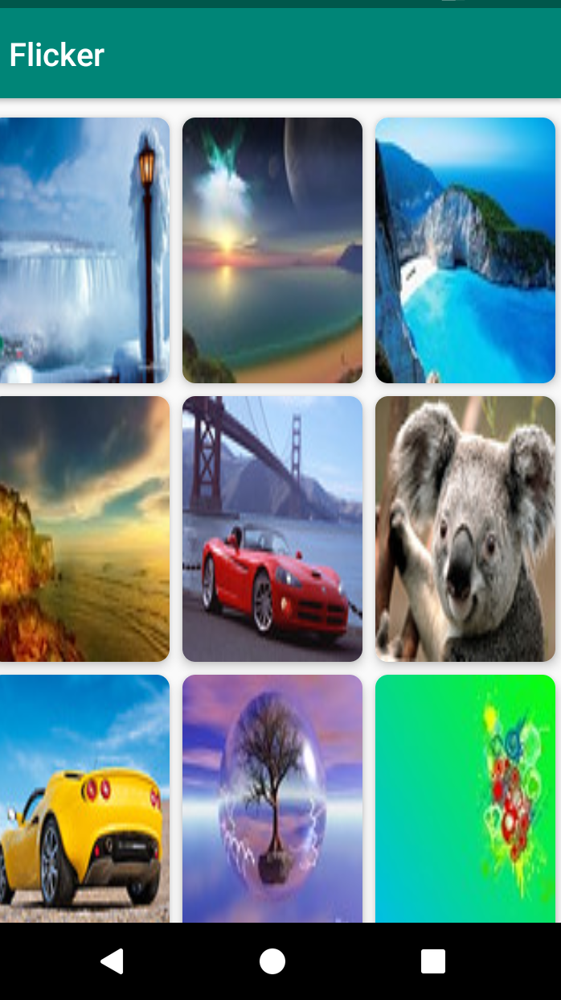

# Flicker-App
An Android app (Gallery App) for displaying public photos using Flicker API ( https://api.flickr.com/services/ )

### Tech Stack
* Kotlin
* Android Studio
* Flicker API
* MVVM
* Retrofit
* Dependency Injection (Dagger2)
* JUnit Test Cases